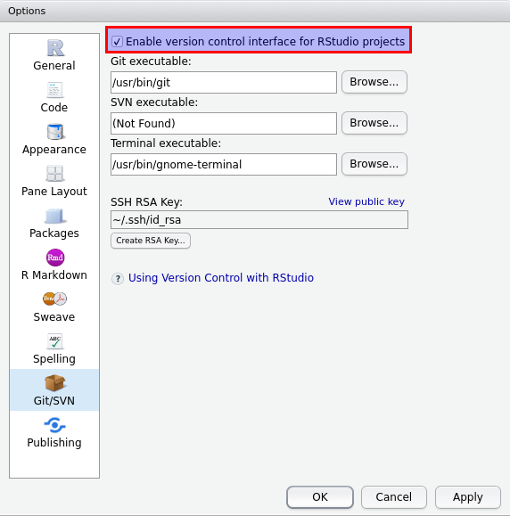
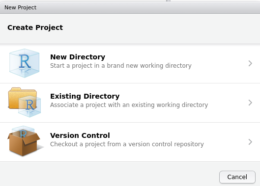
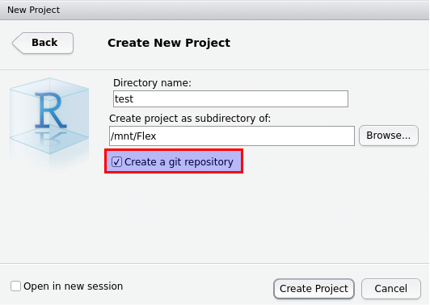
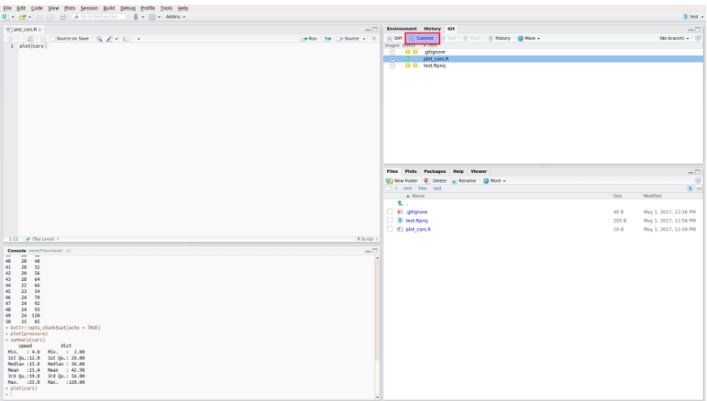
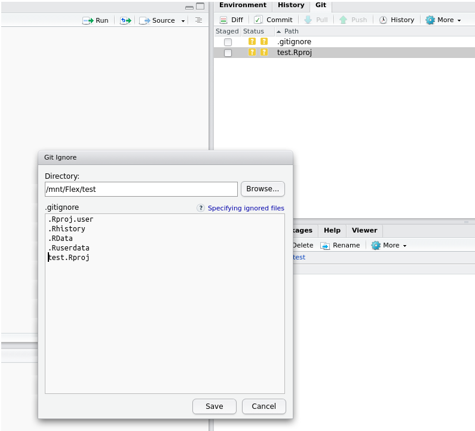
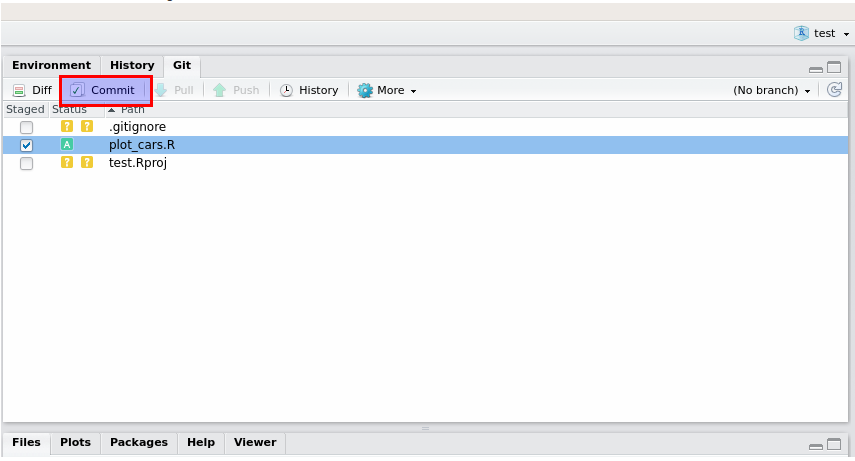
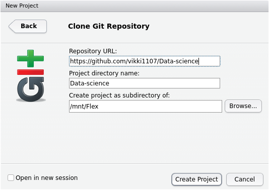
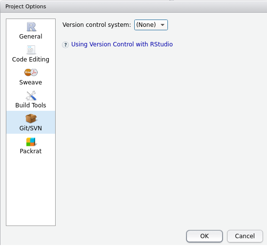
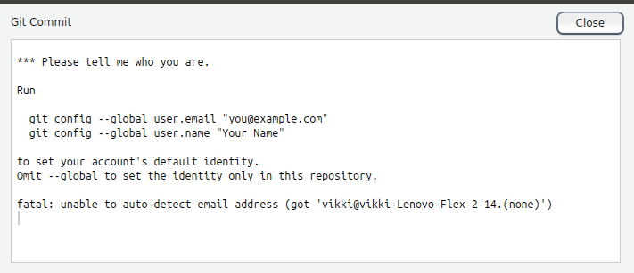

Version control with Git is very useful to maintain changes made to file(s). It is also useful if more than one person is working on the same file. To know more about version control visit [git-scm](https://git-scm.com/book/en/v2/Getting-Started-About-Version-Control). 

RStudio now has integrated two different open source version control tools. 
1. Git
2. SVN (Subversion)

We will be focusing here on Git  
   

####To use Git in Rstdio we need few pre-requisites  
1. You need to install Git from [git-scm](https://git-scm.com/downloads).  
***Note:** It will automatically detect your operating system and gives you link to download*  
2. You should be familiar with creating and working with Project in RStudio.  
***Note:** Because Git feature only works with Projects*  
   

###Enable Git in RStudio
1. Go to **Tools --> Global Options**
2. Click on **Git/SVN**
3. Check **Enable version control interface for RStudio projects**  
***Note:** Usually it will be checked if you have installed git*  
  
 
4. To avoid entering username and password everytime you push your code to Github you can setup SSH RSA Key.  
   

###Set up SSH RSA Keys
1. Click on **Create RSA Key** button
2. Click on **Create** without any passphrase
3. Click on **Close**
4. Click on **View public key** hyperlink 
5. Copy the key from the window 
6. Login to your Github Account and Go to Settings
7. Click on **SSH and GPG keys** from the left side menu
8. Click on **New SSH key** from right top 
9. Provide a **Title** and paste the key under Key section
10. Click **Add SSH key**  
   

###Create a new project and new repository, Commit and push files to GitHub 
####Create a new project in RStudio
1. Go to **File --> New Project**  

2. Click on **New Directory**
3. Click on **Empty Project**
4. Provide the **Directory name, Subdirectory and check Create a git repository**
  
    

####Create a repository in Github {#repo}
1. Login to [Github](https://github.com/) and click on **Create New Repository** from the + icon
2. Provide the project name created in RStudio and click on **Create repository**
3. Copy appropriate code for quick setup. I would copy second chunck of code with 2 lines to push an existing repository.  
   

####Commit and Push local files to Github {#commit}
1. Click on **Git** from the pane that contains Environment, History, Git
2. From the files listed check the relevent files that you wish to upload to github  
***Note 1:** Make sure you save the files you want to upload within your project directory. Only then you will see the files under Git window. Also you don't need to upload Rproj, .gitignore files. Here I am uploading **plot_cars.R** file*  
  
   
3. If you do not need some file to upload then make sure you add them to .gitignore. To do so select the file you want to ignore (no need to check the box) from the Git window and click on **More --> Ignore**. Make sure you have the right file under the ignore list and click **Save**. Below is the screenshot of ignoring test.RProj file.  

   
4. Click on **Commit** from the git window 

   
5. Type in a message under **Commit message** window and click commit. 
6. From the same git window click on **Tools --> Shell**
7. Paste the code copied under point 3 of [Create a repository in Github](#repo) one line at a time in the shell and hit enter. 
8. Refresh your Github page to see all the files commited under RStudio.
9. Now you will see a Pull and Push buttons enabled. Any file you create can now be pushed without running any commands from Shell.  
***Note:** Remember to commit before pushing the files*  
   

###Create a new project using a repository that is already on GitHub
1. Go to **File --> New Project**  
2. Click on **Version Control**
3. Click on **Git**
4. Enter the **Repository URL: and choose a subdirectory** where you want to store the project

   
5. Click **Create Project**  
6. Open shell from **Tools --> Shell** then enter **git remote set-url origin git\@github.com:vikki1107/Data-science.git** to change the origin from https to ssh.
   
Now you can work on the files and push them to your github account
   
   

###Troubleshooting issues
1. **Cannot find Git tab under Environment pane**  
If you don't see Git tab under Environment, History Pane then 
    - go to **Tools --> Project Options**
    - click on **Git/SVN**
    - Change Version Control System from (None) to Git
      
   

2. **error: src refspec master does not match any.**  
If you see the above error followed by error: failed to push some refs to 'git\@github.com:....' then 
    - It means you have not performed commit. So perfrom commit as mentioned under point 3 and 4 of [Commit and Push local files to Github](#commit)  
   

3. **Enter username and password while performing push**
If you are getting a window to enter username and password everytime you are performing push then your origin is set to https instead of ssh. To change that 
    - Go to your GitHub and open the repository. 
    - Click on **Clone or download** 
    - If the url starts with https:// then click on **Use SSH** to see a url that starts with git\@github.com 
    - Copy that and go back to your shell from RStudio **Tools --> Shell** and type **git remote set-url origin \<paste-the-copied-url>**  
 

4. **xcrun: error: invalid active developer path**  
If you are using mac and can't find Git tab while troubleshooting issue 1 and see the above error while commit/push then
    - You need to install xcode-select. To do so run **xcode-select \--install** from your terminal  
   

5. **Please tell me who you are**
  
If you commit and you get error asking who you are then run whatever is displayed on window changing "you\@example.com" to your github email and "Your Name" to your GitHub display name. Example shown below 
    - git config --global user.email "vikki.1107@gmail.com"
    - git config --global user.name "Vivek Limbavali"
   
   

###More resources 
* https://support.rstudio.com/hc/en-us/articles/200532077-Version-Control-with-Git-and-SVN
* https://www.r-bloggers.com/rstudio-and-github/
* https://jennybc.github.io/2014-05-12-ubc/ubc-r/session03_git.html
* http://r-bio.github.io/intro-git-rstudio/
* http://r-pkgs.had.co.nz/git.html

    

  

